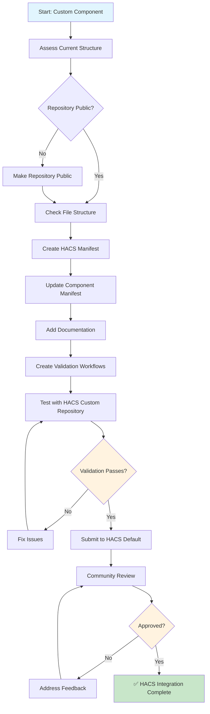
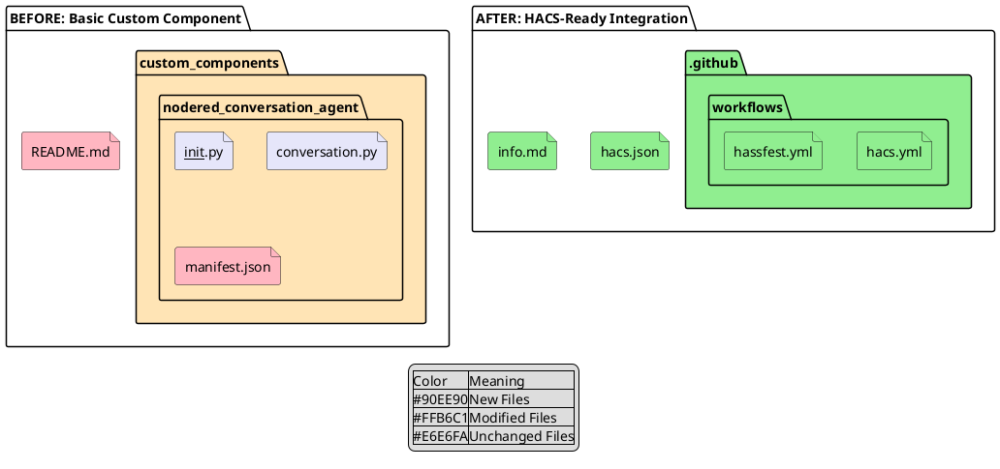
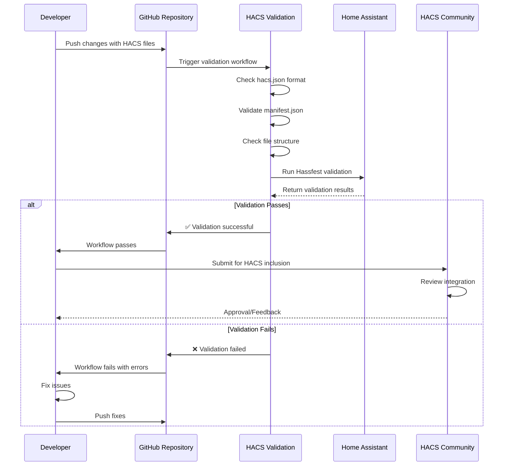
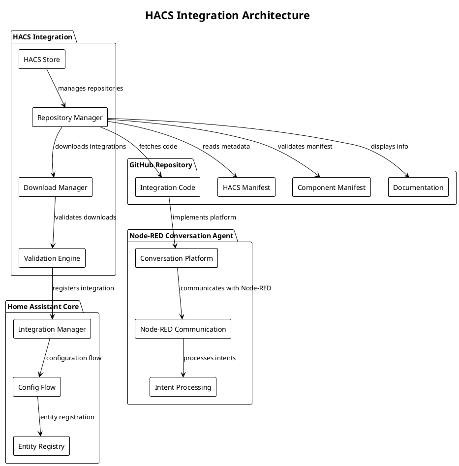
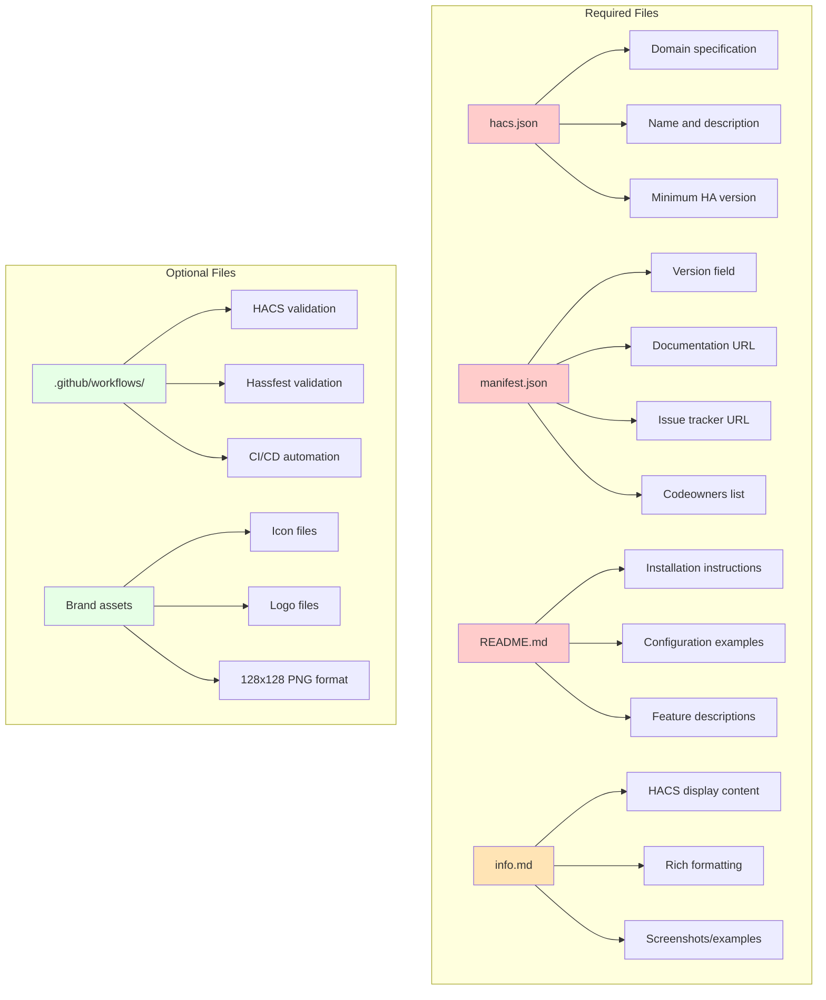
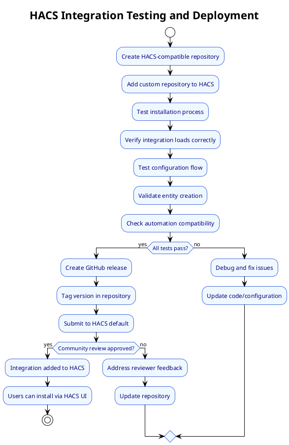

# HACS Integration Conversion Process

## Overview

This document provides PlantUML and Mermaid diagrams to illustrate the step-by-step process of converting a Home Assistant custom component into a HACS (Home Assistant Community Store) integration.

## 1. High-Level Conversion Workflow (Mermaid)

## 2. Repository Structure Transformation (PlantUML)

## 3. HACS Validation Sequence (Mermaid)

## 4. HACS Integration Architecture (PlantUML)

## 5. File Content Requirements (Mermaid)

## 6. Testing and Deployment Process (PlantUML)

## Key Benefits of Visual Documentation

1. **Clear Process Understanding**: Diagrams show the exact steps and decision points
2. **File Structure Clarity**: Before/after comparisons highlight required changes
3. **Workflow Validation**: Sequence diagrams show the validation and approval process
4. **Architecture Overview**: Component relationships and data flow visualization
5. **Testing Guidance**: Step-by-step testing and deployment procedures

These diagrams serve as a complete visual guide for converting any Home Assistant custom component into a HACS-compatible integration.
