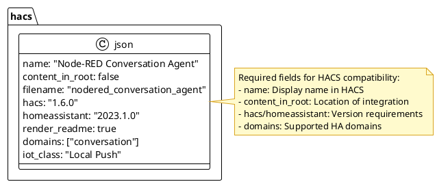
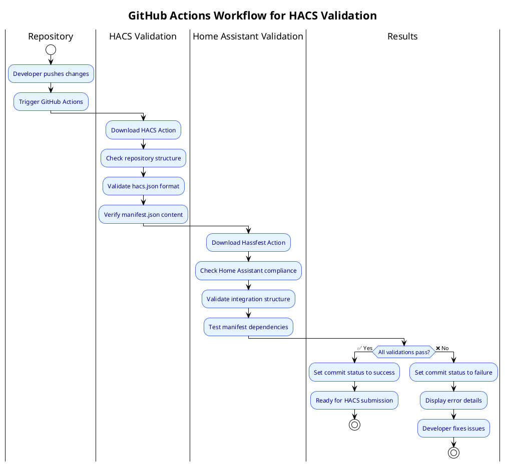
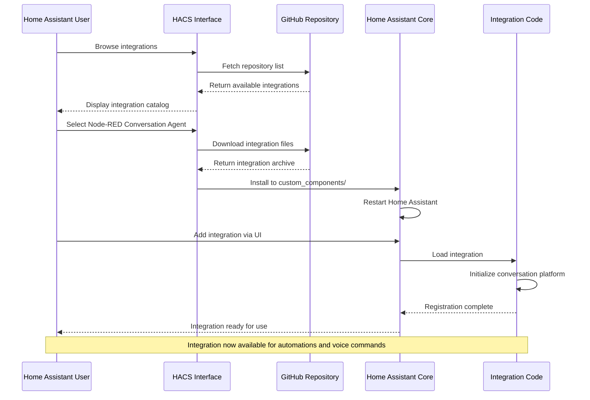
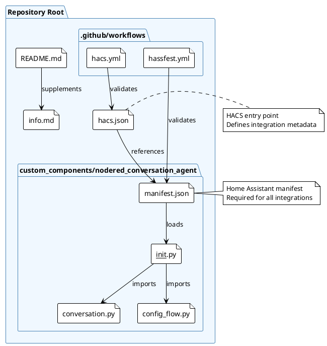
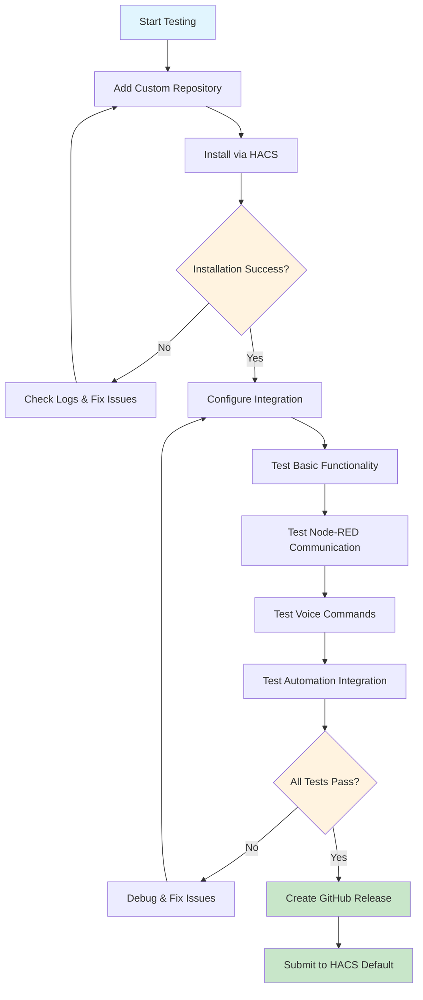
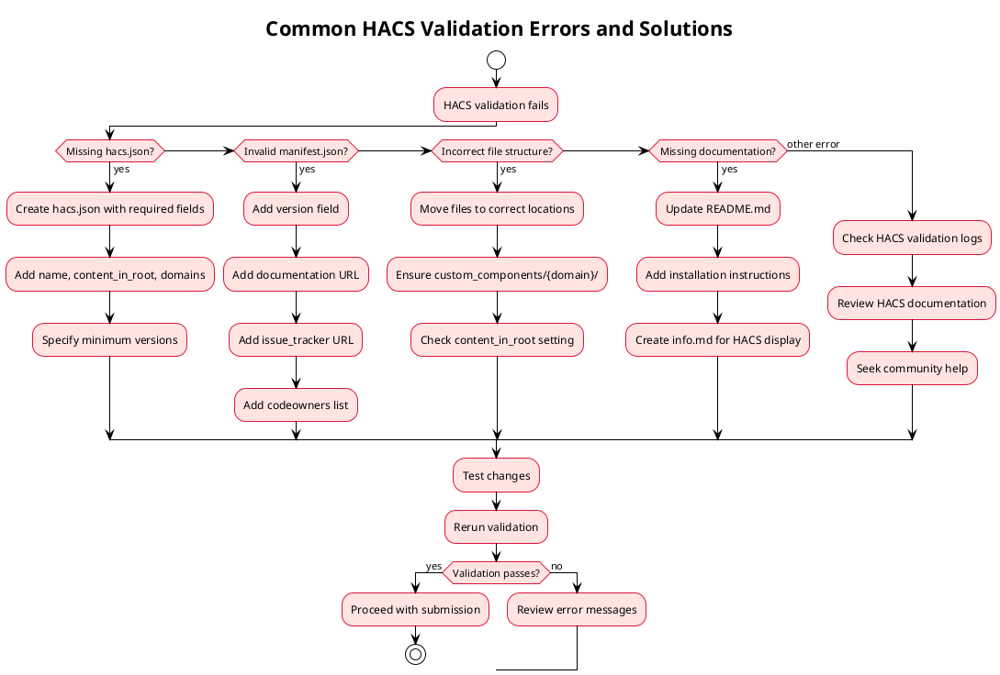
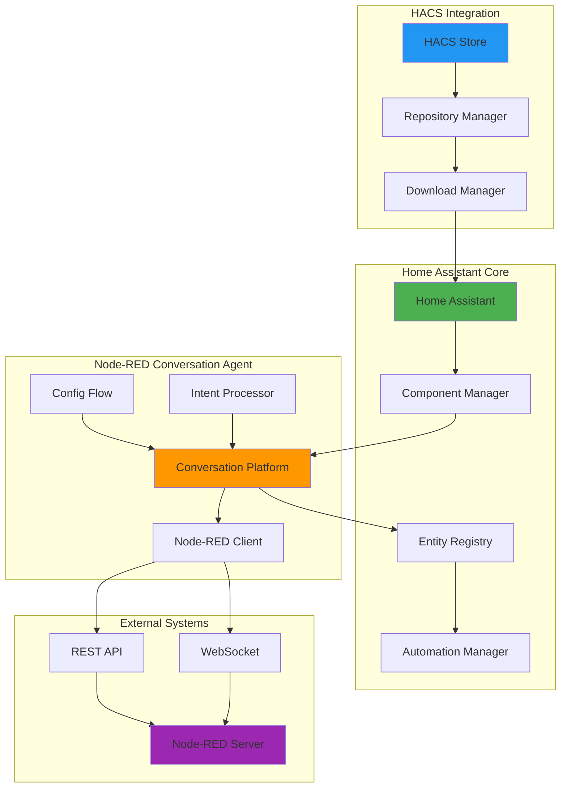

# PlantUML & Mermaid Examples for HACS Integration

## Example HACS Manifest Structure (PlantUML)



## Component Manifest Updates (Mermaid)

```mermaid
graph LR
    subgraph "Original manifest.json"
        A[domain: conversation]
        B[name: Node-RED Conversation Agent]
        C[dependencies: requests]
        D[requirements: []]
    end
    
    subgraph "HACS-Ready manifest.json"
        E[domain: conversation]
        F[name: Node-RED Conversation Agent]
        G[dependencies: requests]
        H[requirements: []]
        I[version: 1.0.0]
        J[documentation: https://github.com/user/repo]
        K[issue_tracker: https://github.com/user/repo/issues]
        L[codeowners: @username]
    end
    
    A --> E
    B --> F
    C --> G
    D --> H
    
    style I fill:#90EE90
    style J fill:#90EE90
    style K fill:#90EE90
    style L fill:#90EE90
```

## HACS Validation Workflow (PlantUML)



## Integration Installation Flow (Mermaid)



## File Dependencies Hierarchy (PlantUML)



## Testing Strategy Overview (Mermaid)



## Error Handling Flow (PlantUML)



## Integration Architecture (Mermaid)



These diagrams provide a comprehensive visual guide for understanding and implementing HACS integration conversion using PlantUML and Mermaid syntax.